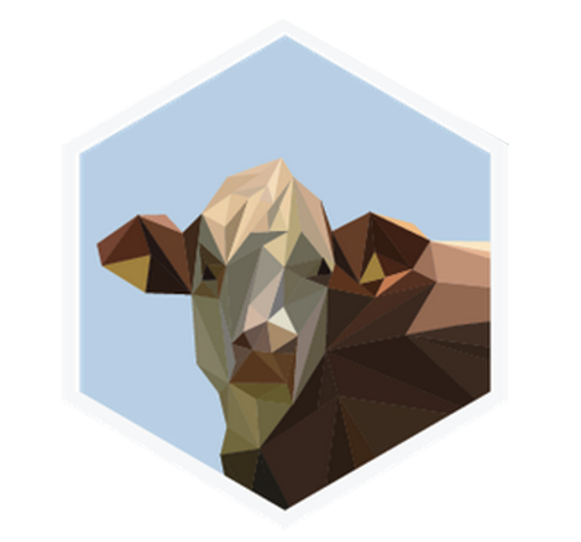

I recieved my BS in Biology from University of California, Los Angeles, in 2020, and started my MPH in Columbia in 2021.

I am interested in Global Health, emerging infectious disease, infectious disease control, data science in public health, and have found a new interest in building websites!
 

I also like sailing, hiking, and traveling to new places!

 This website contains my resume, my Github, a sample dashboard, my contact information, and my P8105 final project, which ended up in the top 5 projects of the semester (observe below the cow sticker we received as a reward)

fun fact about me: Even though I was born in the United States, I grew up in Georgia (the country).

 

  

